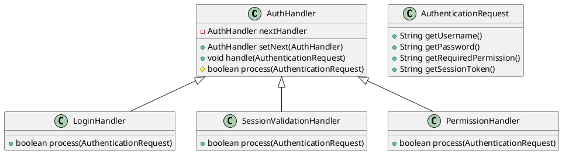
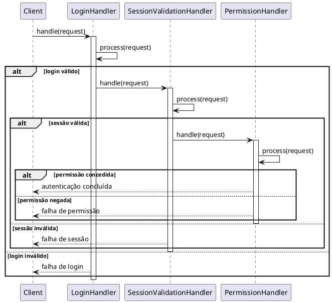

# Chain of Responsibility: Autenticação com login, sessão e permissão

## Tema escolhido
Autenticação usando a cadeia de responsabilidade (Chain of Responsibility):
- `LoginHandler` -> verifica login e senha
- `SessionValidationHandler` -> valida token de sessão
- `PermissionHandler` -> verifica se o usuário tem a permissão necessária

## 1. Classes concretas
- `AuthHandler` (handler abstrato)
- `LoginHandler` (concrete handler)
- `SessionValidationHandler` (concrete handler)
- `PermissionHandler` (concrete handler)
- `AuthenticationRequest` (objeto de contexto)

## 2. Diagrama de classes (PlantUML)


## 3. Explicação do fluxo e diagrama de sequência

### Fluxo de execução
1. A solicitação de autenticação (`AuthenticationRequest`) entra na cadeia pelo `LoginHandler`.
2. `LoginHandler` valida usuário e senha.
   - Se falhar, a cadeia para e a autenticação é rejeitada.
   - Se passar, delega ao próximo handler.
3. `SessionValidationHandler` valida o token de sessão.
   - Se inválido, a cadeia para e a solicitação é rejeitada.
   - Se válido, delega ao próximo handler.
4. `PermissionHandler` verifica se a permissão exigida é permitida.
   - Se negada, a cadeia para.
   - Se concedida, a autenticação é concluída com sucesso.

### Diagrama de sequência (PlantUML)


## Como executar
Compile e execute o arquivo Java:

```bash
javac AuthenticationCoR.java
java AuthenticationCoR
```

## Resultado esperado
O programa mostra o fluxo completo para várias requisições, incluindo casos de:
- login bem-sucedido
- senha incorreta
- token de sessão inválido
- permissão negada
